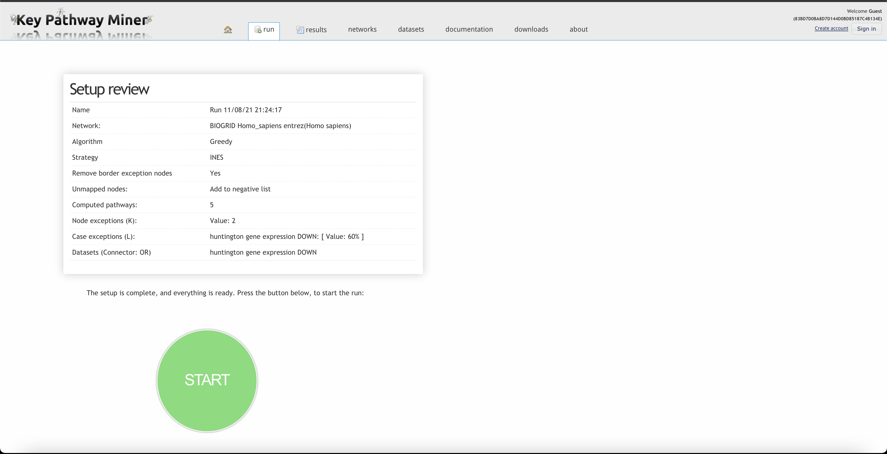
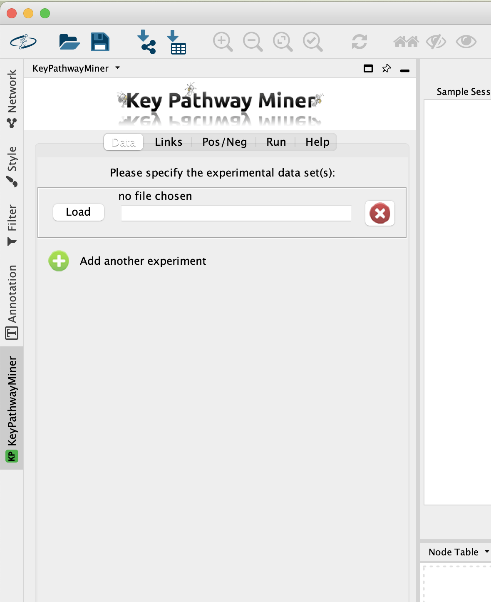
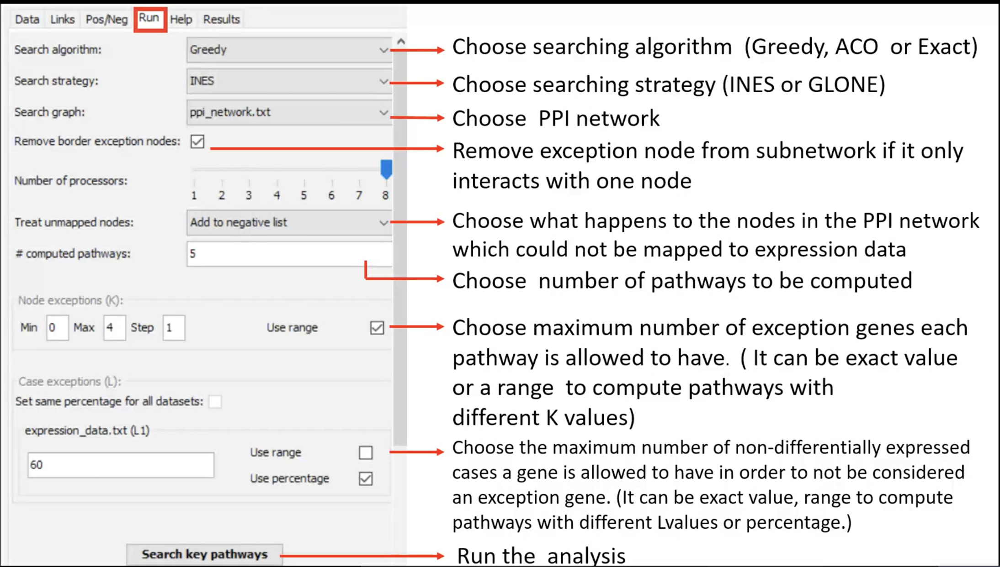
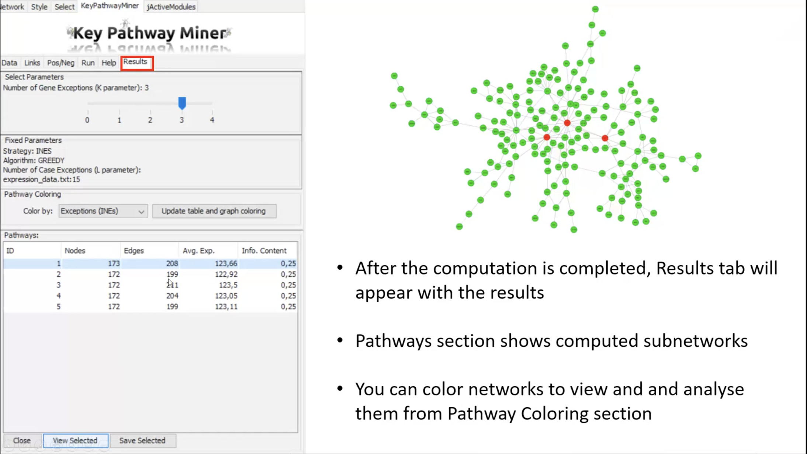

# Subnetwork Discovery
1. Context specific subnetwork discovery
1. Integration of omics data extract maximal connected sub-networks
1. By mapping the omics data such as gene expression data on a molecular interaction network, the relations between genes become easy to see
1. Identify specific parts of a biological system, which are more affected than others.

# Key Pathway Miner

## Cytoscape
1. It allows to adjust outcomes as an image
1. Either Greddy or ACO might be used

## Standalone
1. The fastest
1. It allows to analyze with different parameters
1. It gives outcomes as a file not a visual
1. Either Greddy or ACO might be used

## Web
1. It gives outcomes as an image
1. Internet connection is necessary
1. Only Greedy might be used

#
We had a look at this [website](https://keypathwayminer.compbio.sdu.dk/keypathwayminer/)
# 
And then, We try to run with a default database on the website. However, it didn't worked well when we pressed to start. There was a problem for sure.

#

Eventually, we try to use KPM via Cytoscape by downloading 'keypathminer' from App Manager in the app.

#

#

#

#

 The tutor showed us how to use KPM in the Cytoscape, and did an example.

