##
1. I've already done subnetwork analysis and combining ppi network with my geo2r data before (you may have a look at this via [here](https://github.com/enesbasbug/System_Biology_Internship_Notebook_2021/blob/main/Week-3/Day-14/Day-14.md)).
1. You may also find that specific ppi network given by tutor in Day-15 folder. [HERE](https://github.com/enesbasbug/System_Biology_Internship_Notebook_2021/tree/main/Week-3/Day-15)
1. Today, I'd like to focus on hub nodes and gProfiler analyses.
#

1. 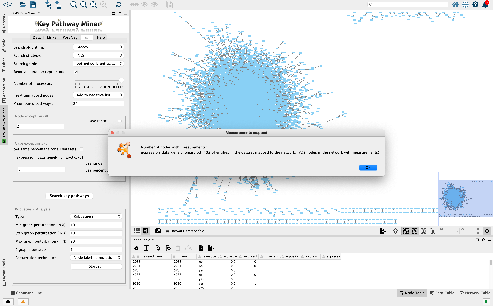
#
1. 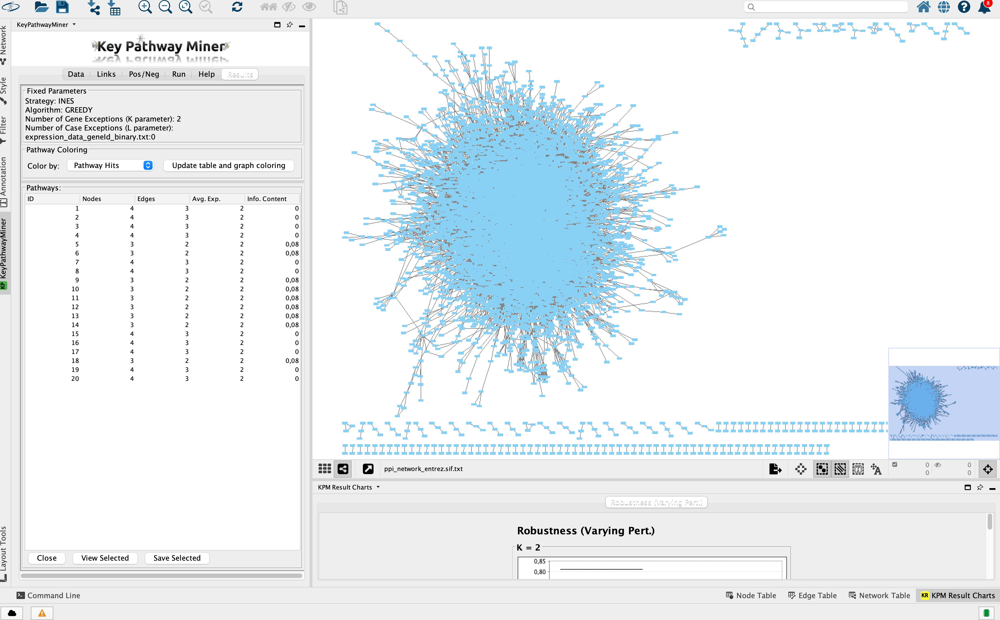
#
1. 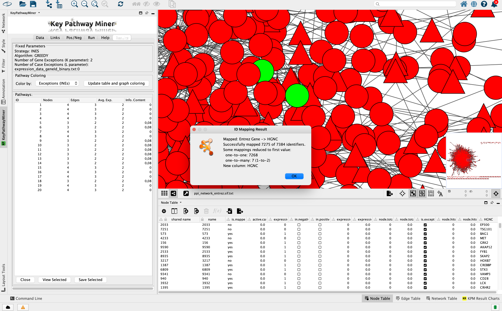
    1. Right click to shared name -> Map Column -> Map From:Entrez -> To HGNC (gene)
#
1. 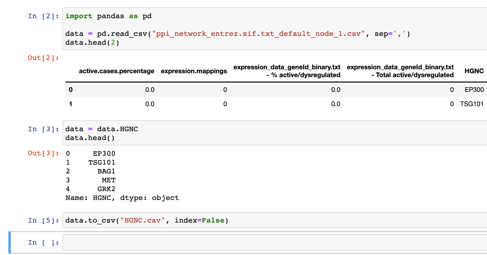
    1. Choose only HGNC values to use it in the next step
#
1. 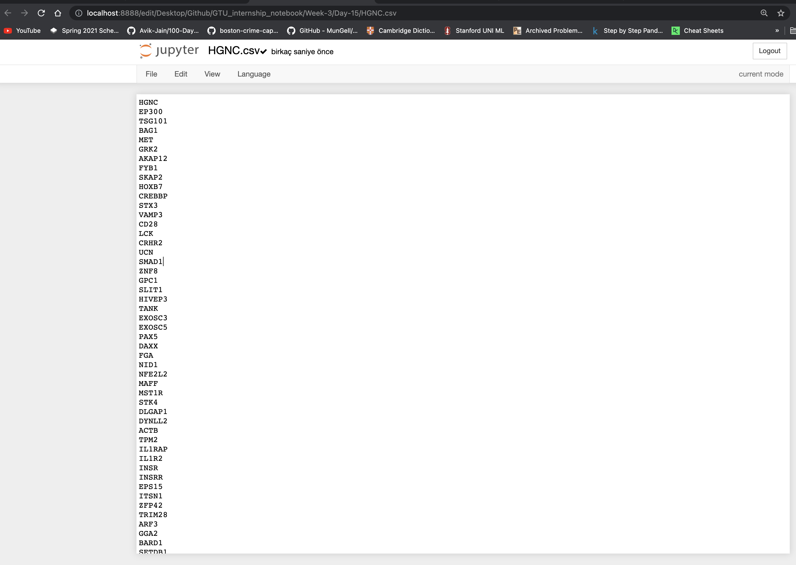
#
1. 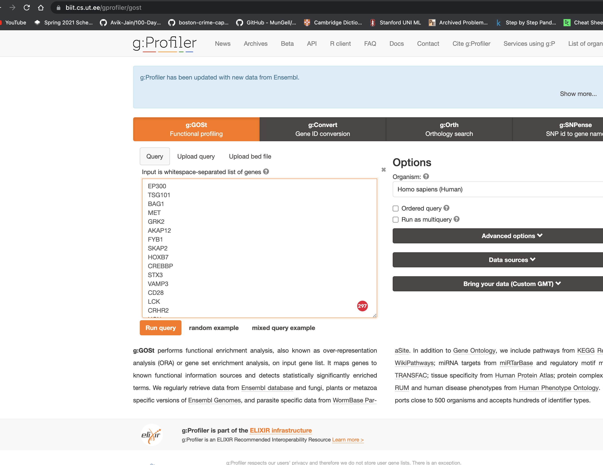
    1. copy-paste to given website. Then, run query.
#
1. 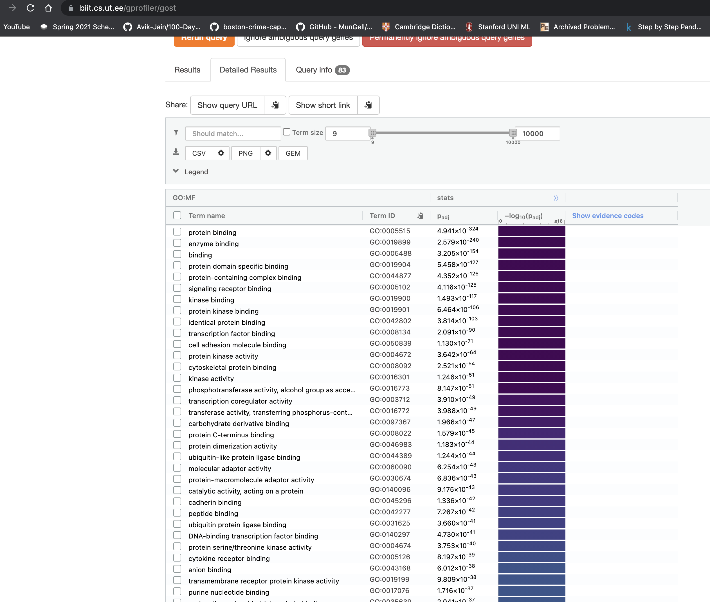
    1. g:Profiler outcome : https://biit.cs.ut.ee/gplink/l/ErNJ5lIJSQ
#
1. 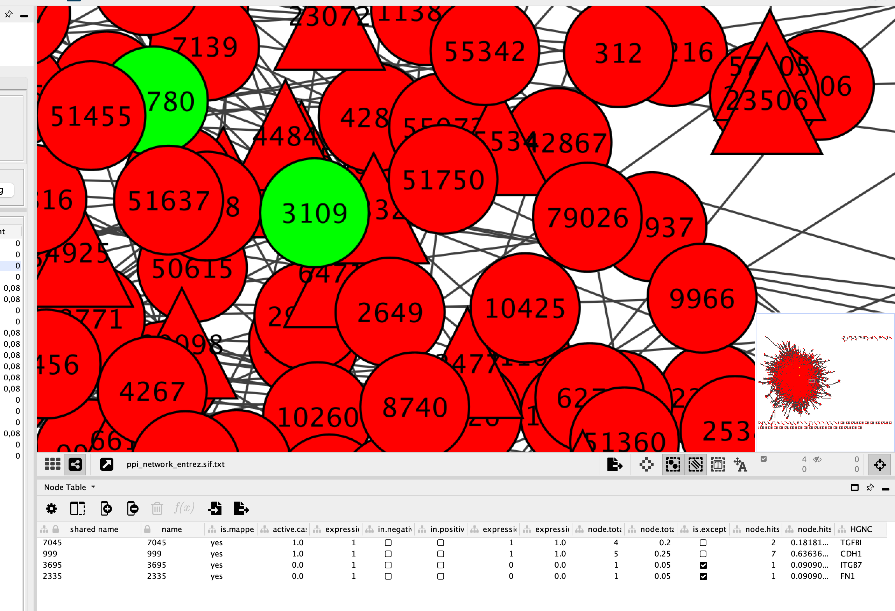
    1. I was going to choose a node that was called Expectation (INEs)
#
1. 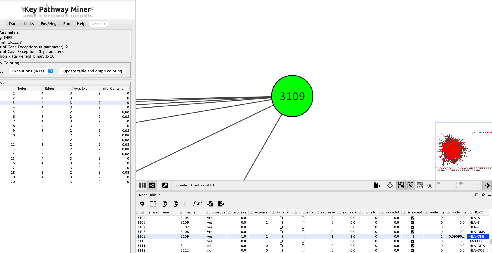
    1. I found this entrez id in Node Table below, and copied the HGNC value
#
1. 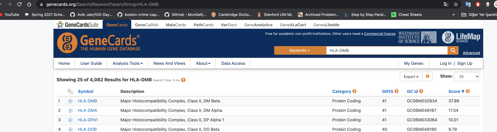
    1. Go GeneCards.org (In order to investigate our hub node -> paste HGNC value.
#
1. 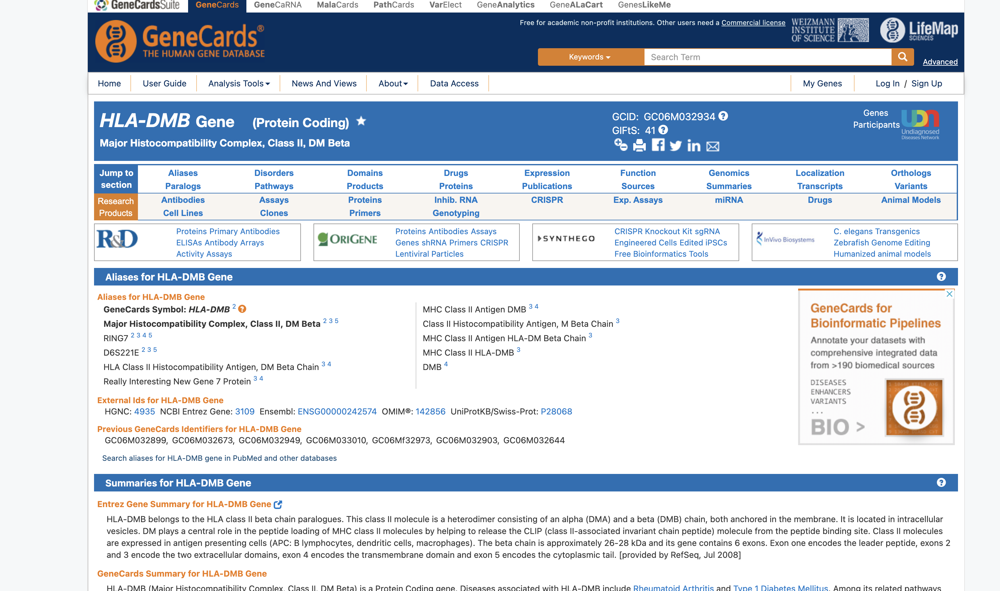
    1. There you are. You got plenty of information about that gene. You may have a look at this via [here](https://www.genecards.org/cgi-bin/carddisp.pl?gene=HLA-DMB&keywords=HLA%5C-DMB)
#
1. 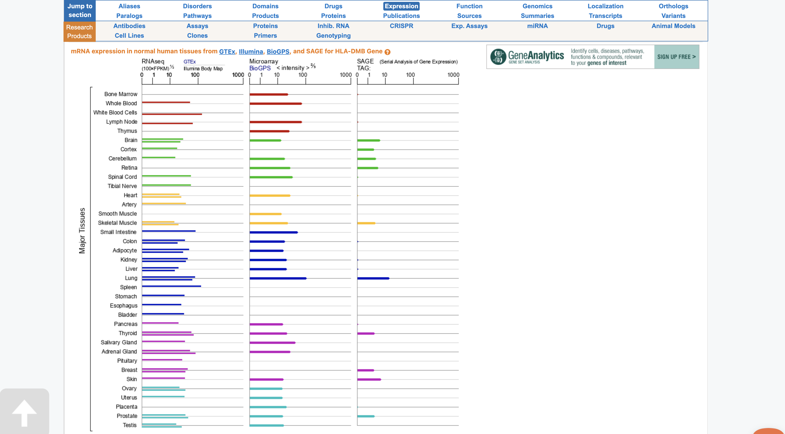
#
1. 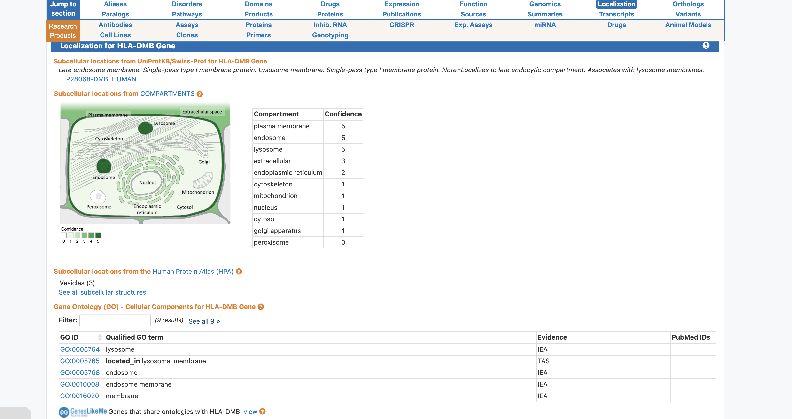
#

