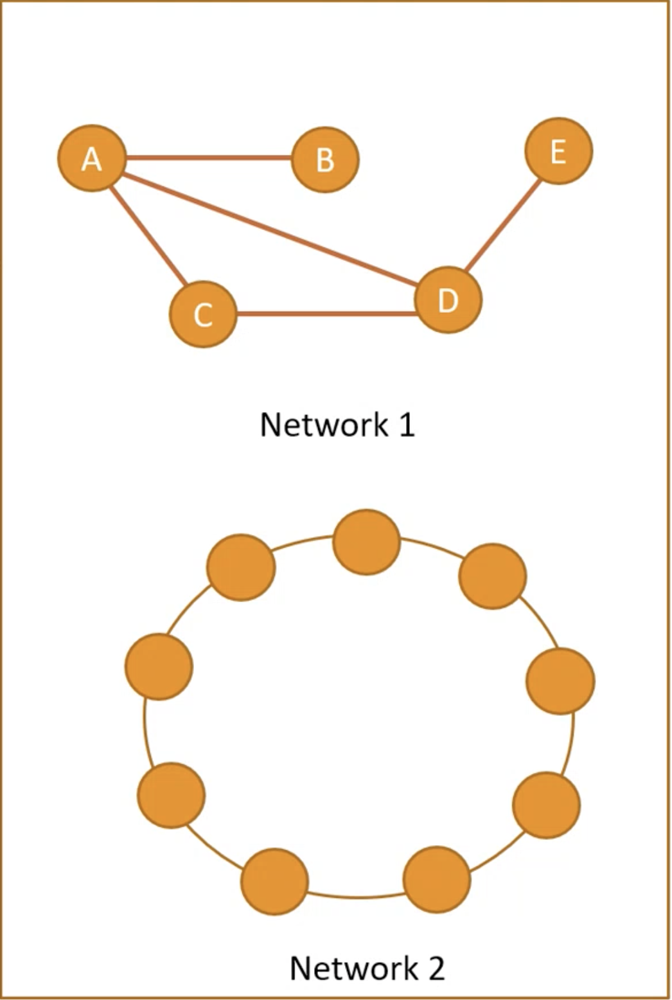

### Homework
1. Create adjacency matrix and list representation of the network 1. --- dk 6:37
1. Find average path length, diameter and draw degree distribution of the network 1. --- dk 10:37
1. Find diameter and draw degree distribution graph of the network2. --- dk 14 falan
1. Download Cytoscape

{:height="200px" width="200px"}

##

