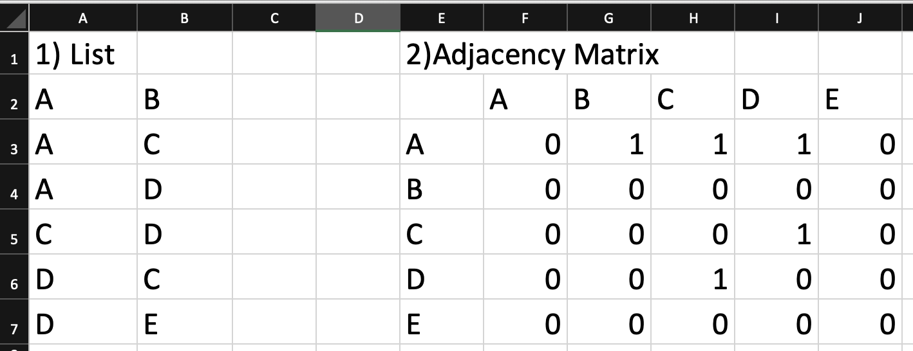
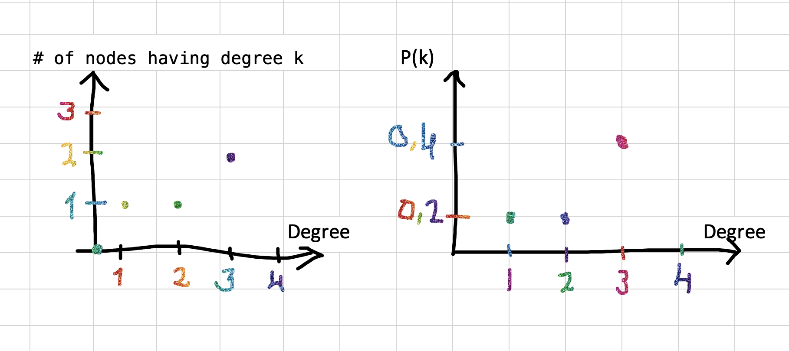

### Homework
1. Create adjacency matrix and list representation of the network 1. 
1. Find average path length, diameter and draw degree distribution of the network 1. 
1. Find diameter and draw degree distribution graph of the network2. 
1. Download Cytoscape

##
# 1. 

# 2. Average path length : 5/5 = 1; Diameter : 3

# 3. COULDN'T DO IT (Diameter : 8?)
